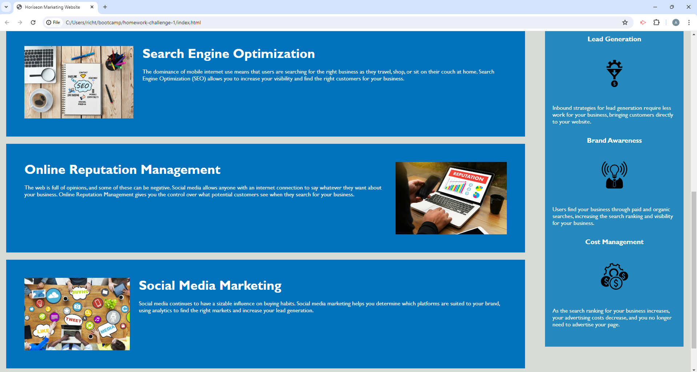

# code-refactor-horiseon-webpage

## Description

A marketing agency hired me for the task of refactoring their marketing website. Their main concern was that they wanted their website to have better accessibility for people with disabilities. They also gave me other criteria they wanted me to fullfill such as making sure that the HTML elements used semantic elements, navigation links were all working, the website had a concise title, and that the CSS code was consolidated and organized to follow the semantic structure of the HTML elements.

## Installation

N/A

## Usage

Below are two screenshots showing what the Horiseon website looks like after I refactored it.

Below is a link to the deployed website
[Horiseon website post refactoring](https://anrichter2.github.io/code-refactor-horiseon-webpage/)

## Credits

N/A

## License

N/A